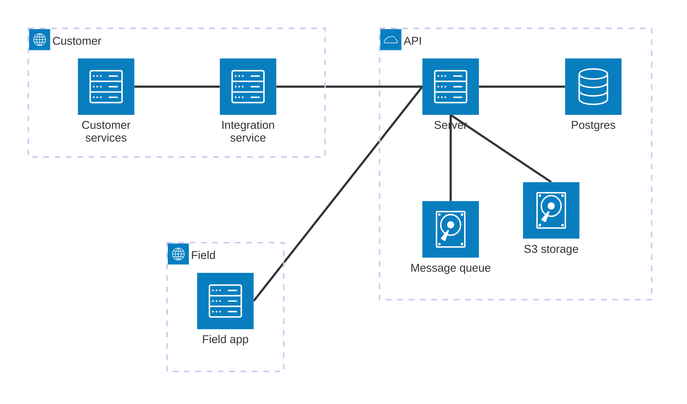

# Big picture

## Field app

Mobile app (PWA) which can be used by field inspectors to:

- Fill a checklist submission
- Create or update a checklist definition

All operations should also be performed when internet connection is not available. Operations performed when offline are stored on the device and are sent to the server as soon as an internet connection is available.